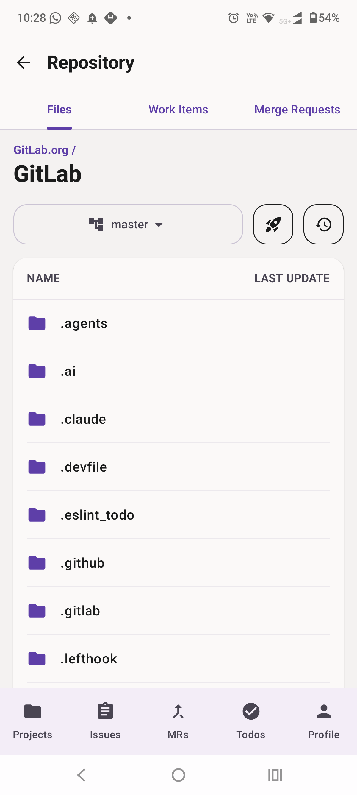
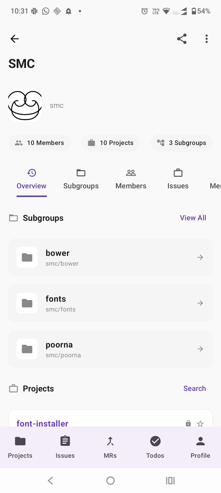
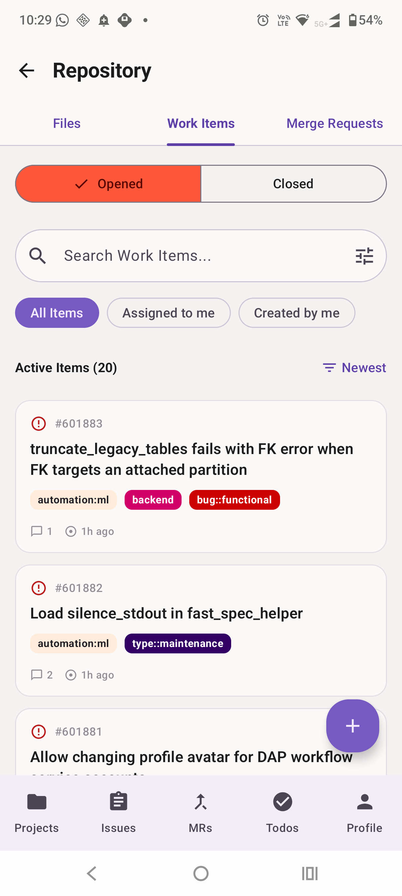
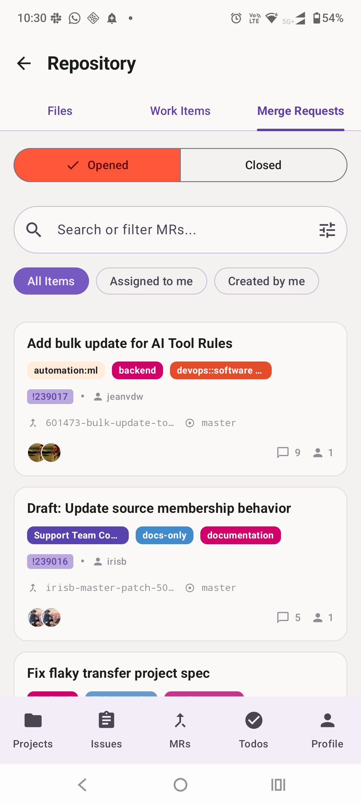
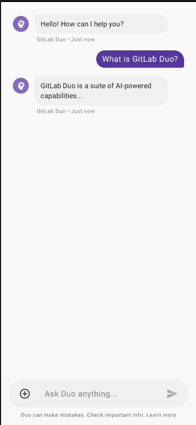
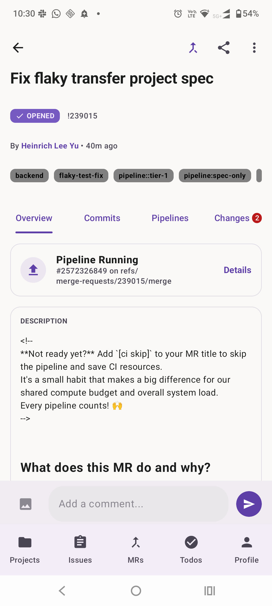
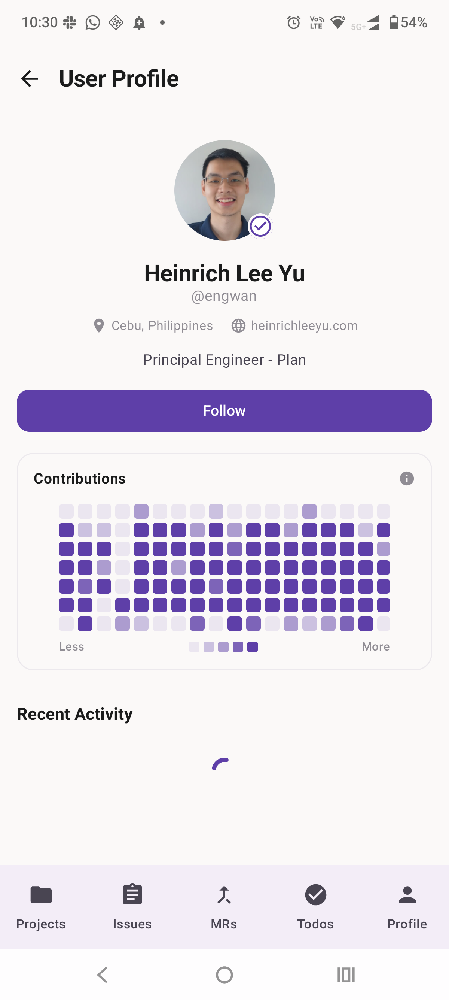

# Labdroid

**Note: This is an unofficial GitLab client and is not affiliated with, endorsed by, or connected to GitLab B.V. in any way.**

> [!WARNING]
> This project is currently in a **pre-alpha** state. Many features are incomplete or may not work as expected.

Labdroid is an Android client for GitLab built with modern Android development practices. It provides a native interface to manage projects, issues, merge requests, and more, directly from your mobile device.

## Features

- **Authentication**: Secure login using GitLab OAuth2 via AppAuth.
- **Project Management**: Browse your projects, groups, and repositories.
- **Work Items**: View, create, and edit issues and epics.
- **Merge Requests**: Track and manage merge requests across your projects.
- **Repository Browser**: Navigate file trees with syntax highlighting for code, rendered markdown support, and image previews.
- **CI/CD**: Monitor pipelines and view job details.
- **Search**: Global search for projects, issues, and merge requests.
- **GitLab Duo Chat**: Integration with GitLab's AI assistant for developer queries.
- **Personalization**: Support for dark mode and customizable settings.

## Screenshots

<p align="center">
  
  
  
</p>
<p align="center">
  
  
  
</p>
<p align="center">
  
</p>

## Technology Stack

- **Language**: Kotlin
- **UI Framework**: Jetpack Compose with Material 3
- **Navigation**: AndroidX Navigation3
- **Dependency Injection**: Hilt
- **Network**: 
    - Apollo GraphQL for the primary data layer.
    - Retrofit for REST API endpoints.
    - OkHttp with logging interceptors.
- **Persistence**: Jetpack DataStore for preferences and token management.
- **Image Loading**: Coil
- **Security**: AndroidX Security-Crypto for encrypted storage.
- **Authentication**: AppAuth for Android.

## Getting Started

### Prerequisites

- Android Studio Ladybug or newer.
- JDK 17.
- A GitLab account and a registered OAuth application.

### Configuration

1. Register an OAuth application in your GitLab settings (User Settings -> Applications).
2. Set the Redirect URI to `in.aboobacker.labdroid://oauth`.
3. Add your `GITLAB_CLIENT_ID` to your `local.properties` file:

```properties
GITLAB_CLIENT_ID=your_client_id_here
```

### Building

```bash
./gradlew assembleDebug
```

## Project Structure

- `app/src/main/java`: Contains the source code organized by feature and layer (ui, data, di).
- `app/src/main/graphql`: Apollo GraphQL schemas and queries.
- `agents.md`: Navigation and implementation guidelines for the project.

## License

This project is licensed under the Mozilla Public License 2.0.
